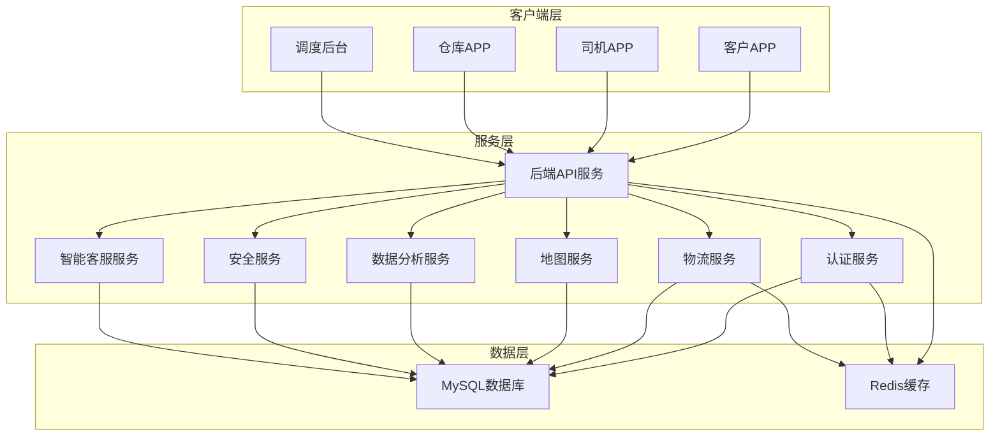

# 前置仓轻客配送系统架构文档

## 1. 系统架构概览

前置仓轻客配送系统采用微服务架构，由多个独立的服务组成，通过API网关进行统一管理和访问。系统主要包含以下组件：

### 1.1 核心组件

| 组件名称 | 描述 | 技术栈 | 端口 |
|---------|------|-------|------|
| 后端API服务 | 系统核心服务，处理业务逻辑 | Node.js, Express.js | 3000 |
| 认证服务 | 处理用户认证和授权 | Node.js, Express.js | 3001 |
| 物流服务 | 处理物流相关业务 | Node.js, Express.js | 3002 |
| 地图服务 | 处理地图相关功能 | Node.js, Express.js | 3003 |
| 数据分析服务 | 处理数据分析和预测 | Node.js, Express.js | 3004 |
| 安全服务 | 处理系统安全 | Node.js, Express.js | 3005 |
| 智能客服服务 | 处理智能客服功能 | Node.js, Express.js | 3006 |
| 客户APP | 客户使用的移动端应用 | uni-app, Vue3 | - |

### 1.2 数据存储

| 存储类型 | 描述 | 技术 |
|---------|------|------|
| 关系型数据库 | 存储业务数据 | MySQL |
| 缓存 | 缓存热点数据 | Redis |

## 2. 系统架构图

## 3. 核心服务设计

### 3.1 后端API服务

- **功能**：系统的核心服务，处理业务逻辑，协调各个微服务
- **技术栈**：Node.js, Express.js, Sequelize, Redis
- **主要模块**：
  - 认证模块：处理用户登录、注册、注销
  - 调度模块：处理智能调度算法
  - 订单模块：处理订单管理
  - 车辆模块：处理车辆管理
  - 任务模块：处理配送任务管理

### 3.2 认证服务

- **功能**：处理用户认证和授权，生成和验证JWT token
- **技术栈**：Node.js, Express.js, Sequelize, JWT
- **主要模块**：
  - 登录模块：验证用户身份，生成token
  - 注册模块：创建新用户
  - 刷新token模块：更新token
  - 注销模块：处理用户注销

### 3.3 物流服务

- **功能**：处理物流相关业务，包括车辆管理、订单管理、任务管理等
- **技术栈**：Node.js, Express.js, Sequelize
- **主要模块**：
  - 车辆管理模块：管理车辆信息
  - 订单管理模块：管理订单信息
  - 任务管理模块：管理配送任务
  - 轨迹管理模块：管理车辆轨迹

### 3.4 地图服务

- **功能**：处理地图相关功能，包括地理编码、路径规划、限行查询等
- **技术栈**：Node.js, Express.js, Axios
- **主要模块**：
  - 地理编码模块：将地址转换为经纬度
  - 逆地理编码模块：将经纬度转换为地址
  - 货车路径规划模块：规划货车行驶路径
  - 限行查询模块：查询车辆限行信息
  - 实时路况查询模块：查询实时路况

### 3.5 数据分析服务

- **功能**：处理数据分析和预测，提供业务分析和决策支持
- **技术栈**：Node.js, Express.js, Sequelize, Chart.js
- **主要模块**：
  - 订单分析模块：分析订单数据
  - 车辆分析模块：分析车辆数据
  - 配送分析模块：分析配送数据
  - 预测分析模块：预测订单量、需求量等

### 3.6 安全服务

- **功能**：处理系统安全，包括认证、授权、加密、安全审计等
- **技术栈**：Node.js, Express.js, Sequelize, JWT, bcryptjs
- **主要模块**：
  - 认证模块：处理用户认证
  - 授权模块：处理用户授权
  - 加密模块：处理数据加密
  - 安全审计模块：记录系统操作日志
  - 权限管理模块：管理用户权限
  - 角色管理模块：管理用户角色

### 3.7 智能客服服务

- **功能**：处理智能客服功能，包括智能问答、订单查询、配送查询等
- **技术栈**：Node.js, Express.js, Sequelize
- **主要模块**：
  - 智能问答模块：处理用户问题
  - 订单查询模块：查询订单信息
  - 配送查询模块：查询配送信息
  - 常见问题模块：管理常见问题
  - 对话历史模块：记录对话历史

## 4. 数据模型设计

### 4.1 用户模型

| 字段名 | 数据类型 | 描述 |
|-------|---------|------|
| id | INTEGER | 用户ID |
| username | STRING | 用户名 |
| password | STRING | 密码（加密） |
| name | STRING | 姓名 |
| email | STRING | 邮箱 |
| phone | STRING | 电话 |
| status | ENUM | 状态（active, inactive, locked） |
| role_id | INTEGER | 角色ID |
| created_at | DATETIME | 创建时间 |
| updated_at | DATETIME | 更新时间 |

### 4.2 订单模型

| 字段名 | 数据类型 | 描述 |
|-------|---------|------|
| id | INTEGER | 订单ID |
| order_no | STRING | 订单号 |
| customer_id | INTEGER | 客户ID |
| customer_name | STRING | 客户姓名 |
| customer_phone | STRING | 客户电话 |
| customer_address | TEXT | 客户地址 |
| total_amount | FLOAT | 总金额 |
| status | ENUM | 状态（pending, processing, delivered, cancelled, paid） |
| payment_method | STRING | 支付方式 |
| paid_at | DATETIME | 支付时间 |
| notes | TEXT | 备注 |
| created_at | DATETIME | 创建时间 |
| updated_at | DATETIME | 更新时间 |

### 4.3 车辆模型

| 字段名 | 数据类型 | 描述 |
|-------|---------|------|
| id | INTEGER | 车辆ID |
| license_plate | STRING | 车牌号 |
| brand | STRING | 品牌 |
| model | STRING | 型号 |
| type | ENUM | 类型（fuel, electric） |
| volume | FLOAT | 容积 |
| weight_capacity | FLOAT | 载重 |
| status | ENUM | 状态（available, in_use, maintenance, broken） |
| last_maintenance | DATETIME | 上次维护时间 |
| notes | TEXT | 备注 |
| created_at | DATETIME | 创建时间 |
| updated_at | DATETIME | 更新时间 |

### 4.4 任务模型

| 字段名 | 数据类型 | 描述 |
|-------|---------|------|
| id | INTEGER | 任务ID |
| task_no | STRING | 任务号 |
| warehouse_id | INTEGER | 仓库ID |
| vehicle_id | INTEGER | 车辆ID |
| driver_id | INTEGER | 司机ID |
| status | ENUM | 状态（pending, in_transit, completed, cancelled） |
| start_time | DATETIME | 开始时间 |
| end_time | DATETIME | 结束时间 |
| notes | TEXT | 备注 |
| created_at | DATETIME | 创建时间 |
| updated_at | DATETIME | 更新时间 |

### 4.5 任务点模型

| 字段名 | 数据类型 | 描述 |
|-------|---------|------|
| id | INTEGER | 任务点ID |
| task_id | INTEGER | 任务ID |
| order_id | INTEGER | 订单ID |
| sequence | INTEGER | 顺序 |
| status | ENUM | 状态（pending, completed） |
| completed_at | DATETIME | 完成时间 |
| created_at | DATETIME | 创建时间 |
| updated_at | DATETIME | 更新时间 |

### 4.6 轨迹模型

| 字段名 | 数据类型 | 描述 |
|-------|---------|------|
| id | INTEGER | 轨迹ID |
| task_id | INTEGER | 任务ID |
| vehicle_id | INTEGER | 车辆ID |
| latitude | FLOAT | 纬度 |
| longitude | FLOAT | 经度 |
| speed | FLOAT | 速度 |
| direction | FLOAT | 方向 |
| timestamp | DATETIME | 时间戳 |
| created_at | DATETIME | 创建时间 |
| updated_at | DATETIME | 更新时间 |

## 5. 系统流程

### 5.1 订单流程

1. 客户通过客户APP下单
2. 系统生成订单，状态为pending
3. 调度系统分配车辆和司机
4. 司机接收任务，开始配送
5. 司机完成配送，更新任务状态
6. 系统更新订单状态为delivered

### 5.2 配送流程

1. 仓库根据订单打包货物
2. 司机到仓库取货
3. 司机按照规划路径配送
4. 司机完成配送，获取客户签名
5. 司机返回仓库

### 5.3 智能调度流程

1. 系统收集订单信息
2. 系统分析车辆状态和位置
3. 系统使用智能调度算法分配任务
4. 系统生成配送任务
5. 司机接收任务

## 6. 技术特性

### 6.1 性能优化

- 使用Redis缓存热点数据
- 数据库查询优化
- API请求限流
- 响应压缩

### 6.2 安全措施

- JWT认证
- 密码加密
- 安全审计
- 权限控制
- 速率限制

### 6.3 可扩展性

- 微服务架构
- 服务独立部署
- 负载均衡
- 水平扩展

### 6.4 可靠性

- 服务容错
- 数据备份
- 监控告警
- 日志记录

## 7. 部署架构

### 7.1 开发环境

- 本地开发环境
- Docker容器
- 代码版本控制（Git）

### 7.2 生产环境

- 云服务器
- 负载均衡
- 数据库集群
- 缓存集群
- 监控系统

## 8. 未来规划

### 8.1 功能扩展

- 多仓库管理
- 多租户支持
- 国际化支持
- 更多支付方式

### 8.2 技术升级

- 容器化部署
- 服务网格
- 无服务器架构
- AI技术深度集成

### 8.3 业务拓展

- 冷链配送
- 同城即时配送
- 跨城物流
- 供应链管理
