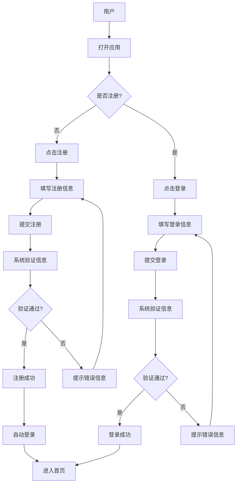
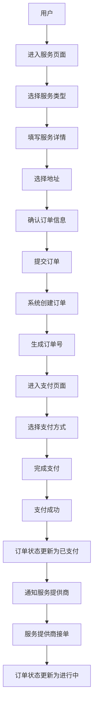
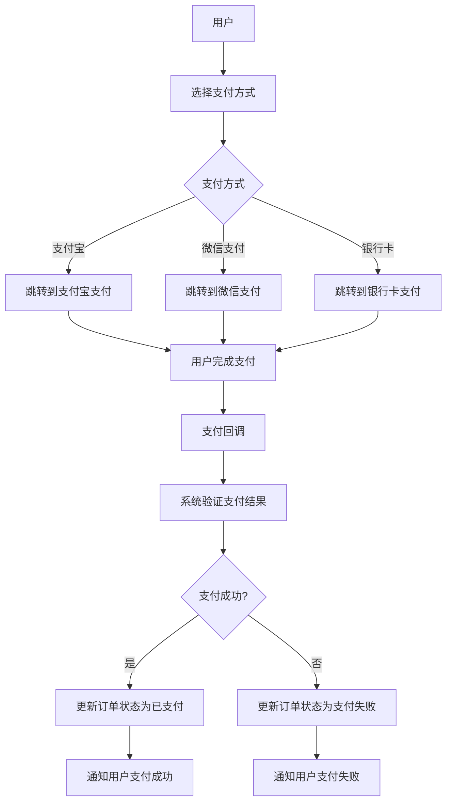
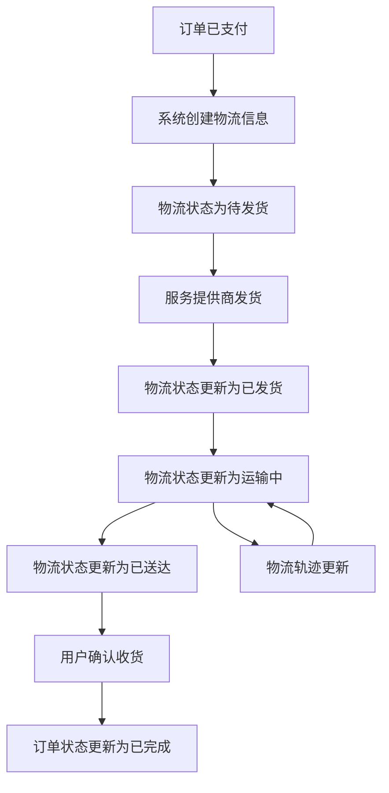
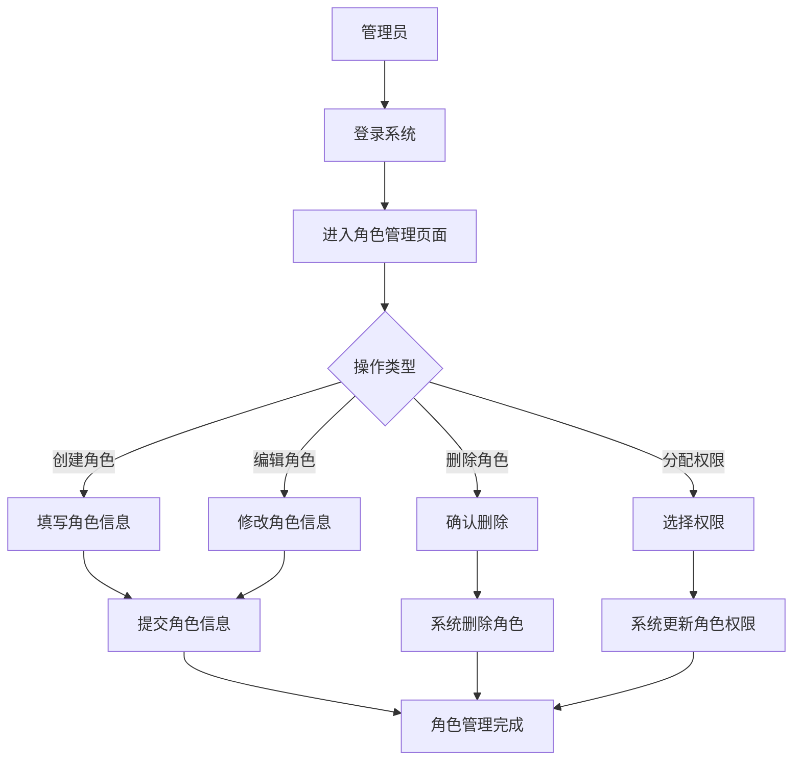

# 米小米拉阿狸项目业务流程文档

## 1. 项目概述

米小米拉阿狸（MIXMLAAL）是一个综合性的在线服务平台，提供外卖、跑腿、打车等多种服务。本文档详细描述了系统的业务流程和使用方式，帮助用户和开发人员理解系统的功能和操作流程。

## 2. 核心业务流程

### 2.1 用户注册与登录流程

### 2.2 订单创建流程

### 2.3 支付流程

### 2.4 物流跟踪流程

### 2.5 角色权限管理流程

## 3. 服务类型

### 3.1 外卖服务

1. **服务内容**：用户可以通过平台下单购买餐饮，由商家配送。
2. **操作流程**：
   - 用户选择外卖服务
   - 浏览商家列表和菜单
   - 选择商品并加入购物车
   - 确认订单信息和地址
   - 完成支付
   - 商家接单并准备餐品
   - 骑手取餐并配送
   - 用户确认收货

### 3.2 跑腿服务

1. **服务内容**：用户可以通过平台下单请求跑腿服务，如取送物品、代买商品等。
2. **操作流程**：
   - 用户选择跑腿服务
   - 填写服务详情（取件地址、送件地址、物品描述等）
   - 确认订单信息和地址
   - 完成支付
   - 跑腿员接单
   - 跑腿员完成服务
   - 用户确认服务完成

### 3.3 打车服务

1. **服务内容**：用户可以通过平台下单请求打车服务，由司机接送。
2. **操作流程**：
   - 用户选择打车服务
   - 填写出发地和目的地
   - 确认订单信息
   - 完成支付
   - 司机接单
   - 司机接送用户
   - 行程结束
   - 用户确认订单完成

## 4. 用户角色

### 4.1 普通用户

- **权限**：
  - 注册、登录、登出
  - 浏览服务、下单
  - 管理个人信息和地址
  - 查看订单历史和物流信息
  - 申请退款

### 4.2 服务提供商

- **权限**：
  - 注册、登录、登出
  - 管理服务信息
  - 接收和处理订单
  - 更新订单状态
  - 管理物流信息

### 4.3 管理员

- **权限**：
  - 所有用户权限
  - 管理用户和服务提供商
  - 管理角色和权限
  - 监控系统状态
  - 配置系统参数

## 5. 系统操作指南

### 5.1 前端操作

#### 5.1.1 注册与登录

1. **注册**：
   - 点击"注册"按钮
   - 填写手机号/邮箱、密码、验证码
   - 点击"注册"按钮
   - 注册成功后自动登录

2. **登录**：
   - 点击"登录"按钮
   - 填写手机号/邮箱、密码
   - 点击"登录"按钮
   - 登录成功后进入首页

#### 5.1.2 下单

1. **选择服务类型**：
   - 在首页选择外卖、跑腿或打车服务

2. **填写服务详情**：
   - 外卖：选择商家和商品
   - 跑腿：填写取件和送件地址、物品描述
   - 打车：填写出发地和目的地

3. **确认订单**：
   - 检查订单信息
   - 选择收货地址
   - 选择支付方式
   - 点击"提交订单"按钮

4. **完成支付**：
   - 跳转到支付页面
   - 完成支付操作
   - 支付成功后订单状态更新

#### 5.1.3 查看订单

1. **进入订单列表**：
   - 点击"我的"页面
   - 点击"我的订单"

2. **查看订单详情**：
   - 点击订单进入详情页面
   - 查看订单状态、物流信息等

3. **申请退款**：
   - 在订单详情页面点击"申请退款"
   - 填写退款原因
   - 提交退款申请

### 5.2 后端操作

#### 5.2.1 服务提供商操作

1. **登录系统**：
   - 使用服务提供商账号登录

2. **管理服务**：
   - 进入服务管理页面
   - 添加、编辑、删除服务

3. **处理订单**：
   - 进入订单管理页面
   - 接收订单
   - 更新订单状态
   - 管理物流信息

#### 5.2.2 管理员操作

1. **登录系统**：
   - 使用管理员账号登录

2. **用户管理**：
   - 进入用户管理页面
   - 查看、编辑、禁用用户

3. **角色权限管理**：
   - 进入角色管理页面
   - 创建、编辑、删除角色
   - 为角色分配权限

4. **系统监控**：
   - 进入监控页面
   - 查看系统指标
   - 处理告警信息

5. **配置管理**：
   - 进入配置页面
   - 更新系统配置
   - 查看配置历史

## 6. 常见问题与解决方案

### 6.1 登录问题

**问题**：无法登录系统
**解决方案**：
- 检查用户名和密码是否正确
- 检查网络连接
- 点击"忘记密码"重置密码
- 联系客服寻求帮助

### 6.2 支付问题

**问题**：支付失败
**解决方案**：
- 检查支付方式是否支持
- 检查账户余额是否充足
- 检查网络连接
- 尝试使用其他支付方式
- 联系客服寻求帮助

### 6.3 订单问题

**问题**：订单状态未更新
**解决方案**：
- 刷新页面查看最新状态
- 联系服务提供商确认订单状态
- 联系客服寻求帮助

### 6.4 物流问题

**问题**：物流信息未更新
**解决方案**：
- 刷新页面查看最新物流信息
- 联系服务提供商确认物流状态
- 联系客服寻求帮助

## 7. 总结

本业务流程文档详细描述了米小米拉阿狸项目的核心业务流程、服务类型、用户角色和系统操作指南，帮助用户和开发人员理解系统的功能和操作流程。通过本文档，用户可以快速掌握系统的使用方法，开发人员可以更好地理解业务需求，为系统的持续优化和扩展提供参考。