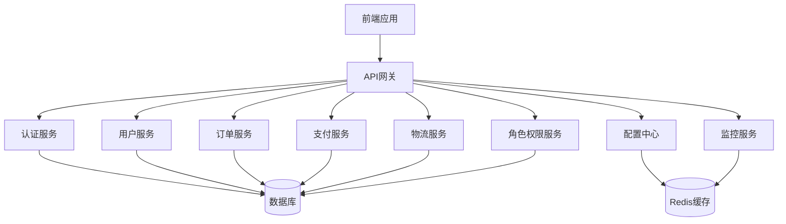

# 米小米拉阿狸项目技术架构文档

## 1. 项目概述

米小米拉阿狸（MIXMLAAL）是一个综合性的在线服务平台，提供外卖、跑腿、打车等多种服务。本项目采用前后端分离架构，前端使用Vue 3 + Vite + Tailwind CSS，后端使用Express.js + Sequelize + SQLite/MySQL。

### 1.1 核心功能

- **用户管理**：注册、登录、个人信息管理
- **订单管理**：创建订单、查询订单、订单状态管理
- **支付系统**：集成支付宝、微信支付、银行卡支付
- **物流系统**：物流跟踪、状态更新、轨迹查询
- **角色权限**：用户角色管理、权限控制
- **监控系统**：系统监控、告警机制
- **配置中心**：集中式配置管理
- **API文档**：Swagger/OpenAPI文档

## 2. 技术栈

| 分类 | 技术 | 版本 | 用途 |
| :--- | :--- | :--- | :--- |
| 前端框架 | Vue 3 | 3.4.0+ | 前端开发 |
| 构建工具 | Vite | 5.0.0+ | 前端构建 |
| 状态管理 | Pinia | 2.1.0+ | 前端状态管理 |
| 样式框架 | Tailwind CSS | 3.4.0+ | 前端样式 |
| 后端框架 | Express.js | 4.18.0+ | 后端API |
| 数据库 | SQLite/MySQL | 3.40.0+/8.0+ | 数据存储 |
| ORM | Sequelize | 6.30.0+ | 数据库操作 |
| 认证 | JWT | 9.0.0+ | 用户认证 |
| 缓存 | Redis | 7.0.0+ | 配置中心、缓存 |
| 文档 | Swagger/OpenAPI | 4.0.0+ | API文档 |
| 测试 | Jest + Supertest | 29.0.0+ | 单元测试和集成测试 |
| 容器化 | Docker | 20.0.0+ | 部署和运行 |

## 3. 架构设计

### 3.1 系统架构



### 3.2 目录结构

```
mixmlaal-app/
├── apps/                # 应用目录
│   ├── frontend/        # 前端应用
│   │   ├── public/       # 静态资源
│   │   ├── src/          # 源代码
│   │   │   ├── assets/   # 资源文件
│   │   │   ├── components/ # 组件
│   │   │   ├── views/    # 页面
│   │   │   ├── router/   # 路由
│   │   │   ├── store/    # 状态管理
│   │   │   ├── services/ # 服务
│   │   │   ├── utils/    # 工具
│   │   │   └── main.js   # 入口文件
│   │   ├── tests/        # 测试
│   │   ├── vite.config.js # Vite配置
│   │   └── package.json  # 依赖配置
│   └── api/              # 后端API
│       ├── src/          # 源代码
│       │   ├── config/   # 配置
│       │   ├── middleware/ # 中间件
│       │   ├── models/   # 数据模型
│       │   ├── routes/   # 路由
│       │   ├── services/ # 服务
│       │   ├── utils/    # 工具
│       │   └── server.js # 服务器入口
│       ├── tests/        # 测试
│       └── package.json  # 依赖配置
├── docs/                # 文档
├── docker/              # Docker配置
├── scripts/             # 脚本
└── package.json          # 项目依赖配置
```

## 4. 核心模块设计

### 4.1 用户模块

- **用户注册**：支持手机号、邮箱注册
- **用户登录**：支持手机号+密码、邮箱+密码登录
- **个人信息管理**：修改头像、昵称、密码等
- **地址管理**：添加、编辑、删除收货地址

### 4.2 订单模块

- **创建订单**：支持外卖、跑腿、打车等多种订单类型
- **订单状态管理**：待支付、已支付、待接单、进行中、已完成、已取消
- **订单查询**：按时间、状态、类型查询订单
- **订单详情**：查看订单详细信息

### 4.3 支付模块

- **支付方式**：支付宝、微信支付、银行卡支付
- **支付流程**：创建支付订单、发起支付、支付回调、支付状态查询
- **退款流程**：申请退款、处理退款、退款状态查询

### 4.4 物流模块

- **物流信息管理**：创建物流信息、更新物流状态
- **物流轨迹**：记录物流的详细轨迹信息
- **物流查询**：根据订单ID、物流ID查询物流信息
- **批量查询**：支持批量查询物流信息

### 4.5 角色权限模块

- **角色管理**：创建、编辑、删除角色
- **权限管理**：创建、编辑、删除权限
- **角色权限关联**：为角色分配权限
- **用户角色关联**：为用户分配角色

### 4.6 监控模块

- **系统监控**：CPU、内存、磁盘使用率监控
- **API监控**：API响应时间、错误率监控
- **告警机制**：基于阈值的告警

### 4.7 配置中心

- **集中式配置**：统一管理系统配置
- **配置热更新**：配置变更实时生效
- **配置回滚**：支持配置版本回滚

## 5. 数据库设计

### 5.1 核心表结构

#### 用户表（users）
| 字段名 | 数据类型 | 约束 | 描述 |
| :--- | :--- | :--- | :--- |
| userId | STRING | PRIMARY KEY | 用户ID |
| username | STRING | NOT NULL | 用户名 |
| email | STRING | UNIQUE | 邮箱 |
| phone | STRING | UNIQUE | 手机号 |
| password | STRING | NOT NULL | 密码 |
| avatar | STRING | | 头像 |
| roleId | STRING | REFERENCES roles(roleId) | 角色ID |
| createdAt | DATE | NOT NULL | 创建时间 |
| updatedAt | DATE | NOT NULL | 更新时间 |

#### 订单表（orders）
| 字段名 | 数据类型 | 约束 | 描述 |
| :--- | :--- | :--- | :--- |
| orderId | STRING | PRIMARY KEY | 订单ID |
| userId | STRING | REFERENCES users(userId) | 用户ID |
| type | STRING | NOT NULL | 订单类型 |
| amount | DECIMAL | NOT NULL | 订单金额 |
| status | STRING | NOT NULL | 订单状态 |
| addressId | STRING | REFERENCES addresses(addressId) | 地址ID |
| createdAt | DATE | NOT NULL | 创建时间 |
| updatedAt | DATE | NOT NULL | 更新时间 |

#### 支付表（payments）
| 字段名 | 数据类型 | 约束 | 描述 |
| :--- | :--- | :--- | :--- |
| paymentId | STRING | PRIMARY KEY | 支付ID |
| orderId | STRING | REFERENCES orders(orderId) | 订单ID |
| userId | STRING | REFERENCES users(userId) | 用户ID |
| amount | DECIMAL | NOT NULL | 支付金额 |
| channel | STRING | NOT NULL | 支付渠道 |
| status | STRING | NOT NULL | 支付状态 |
| tradeNo | STRING | | 交易单号 |
| createdAt | DATE | NOT NULL | 创建时间 |
| updatedAt | DATE | NOT NULL | 更新时间 |

#### 物流表（logistics）
| 字段名 | 数据类型 | 约束 | 描述 |
| :--- | :--- | :--- | :--- |
| logisticsId | STRING | PRIMARY KEY | 物流ID |
| orderId | STRING | REFERENCES orders(orderId) | 订单ID |
| carrier | STRING | NOT NULL | 物流公司 |
| trackingNumber | STRING | NOT NULL | 运单号 |
| status | STRING | NOT NULL | 物流状态 |
| estimatedDelivery | DATE | | 预计送达时间 |
| actualDelivery | DATE | | 实际送达时间 |
| createdAt | DATE | NOT NULL | 创建时间 |
| updatedAt | DATE | NOT NULL | 更新时间 |

#### 物流轨迹表（logistics_tracks）
| 字段名 | 数据类型 | 约束 | 描述 |
| :--- | :--- | :--- | :--- |
| trackId | STRING | PRIMARY KEY | 轨迹ID |
| logisticsId | STRING | REFERENCES logistics(logisticsId) | 物流ID |
| timestamp | DATE | NOT NULL | 时间点 |
| location | STRING | NOT NULL | 地点 |
| status | STRING | NOT NULL | 状态 |
| description | TEXT | NOT NULL | 描述 |
| createdAt | DATE | NOT NULL | 创建时间 |

#### 角色表（roles）
| 字段名 | 数据类型 | 约束 | 描述 |
| :--- | :--- | :--- | :--- |
| roleId | STRING | PRIMARY KEY | 角色ID |
| name | STRING | NOT NULL | 角色名称 |
| description | TEXT | | 角色描述 |
| createdAt | DATE | NOT NULL | 创建时间 |
| updatedAt | DATE | NOT NULL | 更新时间 |

#### 权限表（permissions）
| 字段名 | 数据类型 | 约束 | 描述 |
| :--- | :--- | :--- | :--- |
| permissionId | STRING | PRIMARY KEY | 权限ID |
| name | STRING | NOT NULL | 权限名称 |
| description | TEXT | | 权限描述 |
| createdAt | DATE | NOT NULL | 创建时间 |
| updatedAt | DATE | NOT NULL | 更新时间 |

## 6. API设计

### 6.1 认证API

| 路径 | 方法 | 描述 | 权限 |
| :--- | :--- | :--- | :--- |
| `/api/v1/auth/register` | POST | 用户注册 | 无 |
| `/api/v1/auth/login` | POST | 用户登录 | 无 |
| `/api/v1/auth/logout` | POST | 用户登出 | 需认证 |
| `/api/v1/auth/refresh` | POST | 刷新令牌 | 需认证 |

### 6.2 用户API

| 路径 | 方法 | 描述 | 权限 |
| :--- | :--- | :--- | :--- |
| `/api/v1/user/profile` | GET | 获取用户信息 | 需认证 |
| `/api/v1/user/profile` | PUT | 更新用户信息 | 需认证 |
| `/api/v1/user/password` | PUT | 修改密码 | 需认证 |
| `/api/v1/user/addresses` | GET | 获取地址列表 | 需认证 |
| `/api/v1/user/addresses` | POST | 添加地址 | 需认证 |
| `/api/v1/user/addresses/:addressId` | PUT | 更新地址 | 需认证 |
| `/api/v1/user/addresses/:addressId` | DELETE | 删除地址 | 需认证 |

### 6.3 订单API

| 路径 | 方法 | 描述 | 权限 |
| :--- | :--- | :--- | :--- |
| `/api/v1/order` | POST | 创建订单 | 需认证 |
| `/api/v1/order/:orderId` | GET | 获取订单详情 | 需认证 |
| `/api/v1/order` | GET | 获取订单列表 | 需认证 |
| `/api/v1/order/:orderId` | PUT | 更新订单状态 | 需认证 |
| `/api/v1/order/:orderId` | DELETE | 取消订单 | 需认证 |

### 6.4 支付API

| 路径 | 方法 | 描述 | 权限 |
| :--- | :--- | :--- | :--- |
| `/api/v1/payment/create` | POST | 创建支付 | 需认证 |
| `/api/v1/payment/status/:paymentId` | GET | 查询支付状态 | 需认证 |
| `/api/v1/payment/list` | GET | 获取支付列表 | 需认证 |
| `/api/v1/payment/refund` | POST | 申请退款 | 需认证 |
| `/api/v1/payment/notify/wechat` | POST | 微信支付回调 | 无 |
| `/api/v1/payment/notify/alipay` | POST | 支付宝支付回调 | 无 |

### 6.5 物流API

| 路径 | 方法 | 描述 | 权限 |
| :--- | :--- | :--- | :--- |
| `/api/v1/logistics/create` | POST | 创建物流信息 | 需认证 |
| `/api/v1/logistics/:logisticsId` | GET | 获取物流信息 | 需认证 |
| `/api/v1/logistics/order/:orderId` | GET | 根据订单ID获取物流信息 | 需认证 |
| `/api/v1/logistics/track/:logisticsId` | GET | 获取物流轨迹 | 需认证 |
| `/api/v1/logistics/update/:logisticsId` | PUT | 更新物流状态 | 需认证 |
| `/api/v1/logistics/list` | GET | 获取物流列表 | 需认证 |
| `/api/v1/logistics/batch` | POST | 批量查询物流信息 | 需认证 |

### 6.6 角色权限API

| 路径 | 方法 | 描述 | 权限 |
| :--- | :--- | :--- | :--- |
| `/api/v1/role` | POST | 创建角色 | 需认证 |
| `/api/v1/role/:roleId` | GET | 获取角色信息 | 需认证 |
| `/api/v1/role` | GET | 获取角色列表 | 需认证 |
| `/api/v1/role/:roleId` | PUT | 更新角色信息 | 需认证 |
| `/api/v1/role/:roleId` | DELETE | 删除角色 | 需认证 |
| `/api/v1/role/:roleId/permissions` | POST | 为角色分配权限 | 需认证 |
| `/api/v1/permission` | POST | 创建权限 | 需认证 |
| `/api/v1/permission/:permissionId` | GET | 获取权限信息 | 需认证 |
| `/api/v1/permission` | GET | 获取权限列表 | 需认证 |
| `/api/v1/permission/:permissionId` | PUT | 更新权限信息 | 需认证 |
| `/api/v1/permission/:permissionId` | DELETE | 删除权限 | 需认证 |

### 6.7 监控API

| 路径 | 方法 | 描述 | 权限 |
| :--- | :--- | :--- | :--- |
| `/api/v1/monitor/metrics` | GET | 获取系统指标 | 需认证 |
| `/api/v1/monitor/alerts` | GET | 获取告警信息 | 需认证 |
| `/api/v1/monitor/logs` | GET | 获取系统日志 | 需认证 |

### 6.8 配置API

| 路径 | 方法 | 描述 | 权限 |
| :--- | :--- | :--- | :--- |
| `/api/v1/config` | GET | 获取配置 | 需认证 |
| `/api/v1/config` | PUT | 更新配置 | 需认证 |
| `/api/v1/config/history` | GET | 获取配置历史 | 需认证 |

## 7. 部署与运维

### 7.1 开发环境

1. **安装依赖**
   ```bash
   npm install
   ```

2. **启动前端开发服务器**
   ```bash
   npm run dev:frontend
   ```

3. **启动后端开发服务器**
   ```bash
   npm run dev
   ```

### 7.2 生产环境

1. **构建前端**
   ```bash
   npm run build:frontend
   ```

2. **构建后端**
   ```bash
   npm run build:api
   ```

3. **启动服务**
   ```bash
   npm run start
   ```

### 7.3 Docker部署

1. **构建镜像**
   ```bash
   docker build -t mixmlaal-app .
   ```

2. **运行容器**
   ```bash
   docker run -p 3000:3000 -p 8080:8080 mixmlaal-app
   ```

## 8. 安全措施

### 8.1 认证与授权

- **JWT认证**：使用JWT进行用户认证
- **密码加密**：使用bcrypt对密码进行加密
- **权限控制**：基于角色的权限控制

### 8.2 数据安全

- **输入验证**：对所有输入进行验证
- **SQL注入防护**：使用参数化查询
- **XSS防护**：对输出进行转义
- **CSRF防护**：使用CSRF令牌

### 8.3 网络安全

- **HTTPS**：使用HTTPS加密传输
- **CORS**：配置适当的CORS策略
- **Rate Limiting**：限制API请求频率

## 9. 监控与告警

### 9.1 系统监控

- **CPU使用率**：监控CPU使用情况
- **内存使用率**：监控内存使用情况
- **磁盘使用率**：监控磁盘使用情况
- **网络流量**：监控网络流量

### 9.2 API监控

- **响应时间**：监控API响应时间
- **错误率**：监控API错误率
- **请求量**：监控API请求量

### 9.3 告警机制

- **阈值告警**：当指标超过阈值时触发告警
- **告警渠道**：邮件、短信、微信等
- **告警级别**：紧急、重要、一般

## 10. 总结

本项目采用现代化的技术栈和架构设计，实现了一个功能完整、性能优良、安全可靠的在线服务平台。通过前后端分离的架构，提高了开发效率和系统可维护性；通过集成多种支付方式和物流系统，提升了用户体验；通过完善的监控和告警机制，保障了系统的稳定运行。

未来可以考虑进一步优化系统性能，扩展更多服务类型，提升系统的可扩展性和可靠性。